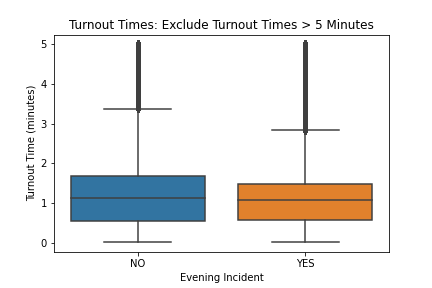
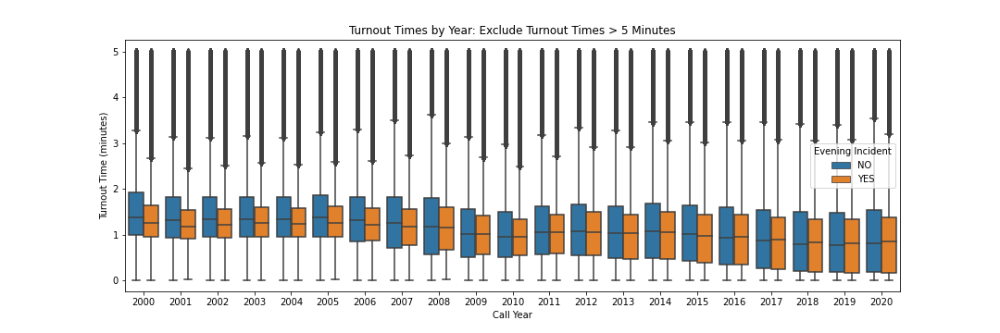
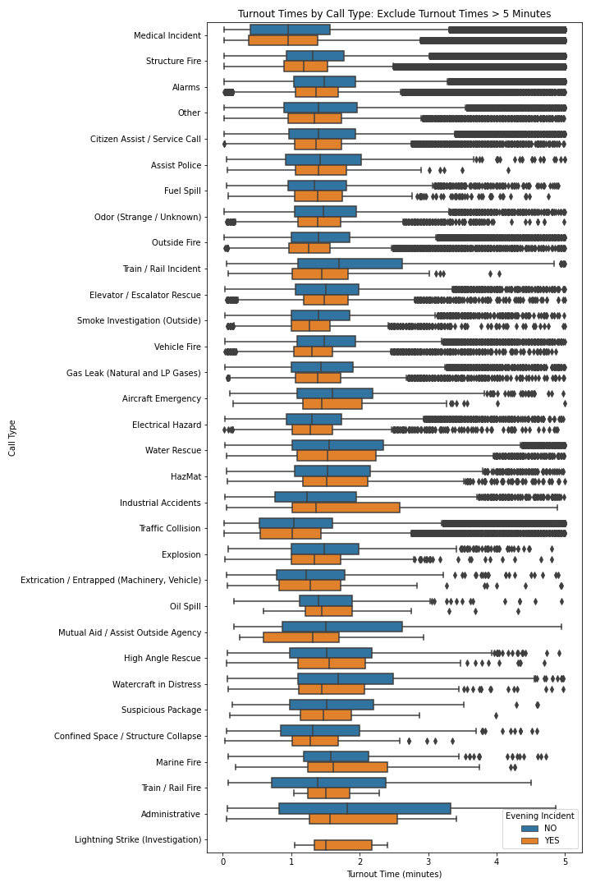
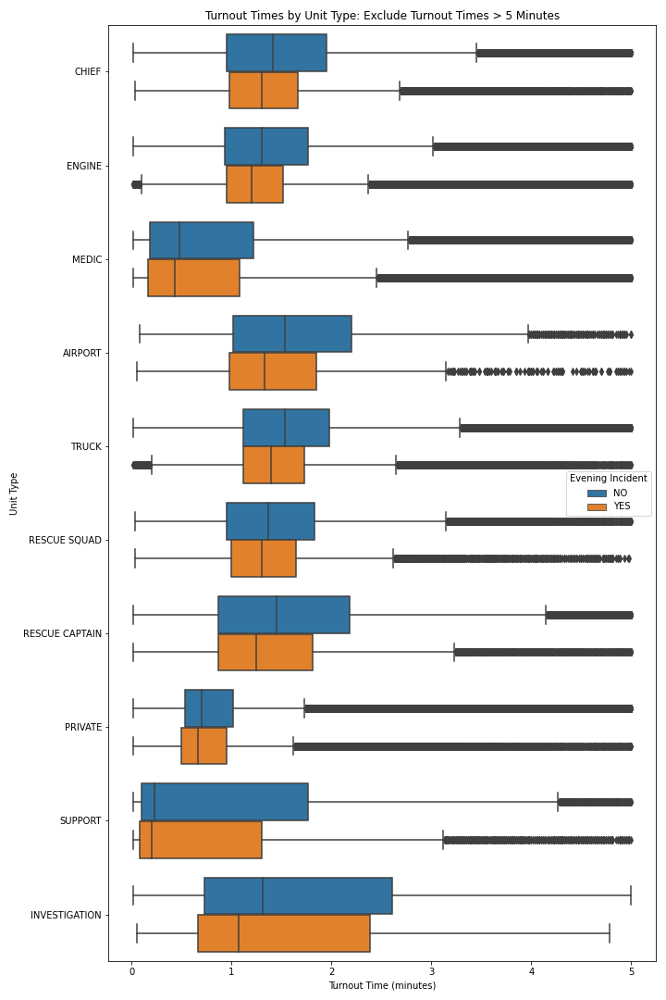
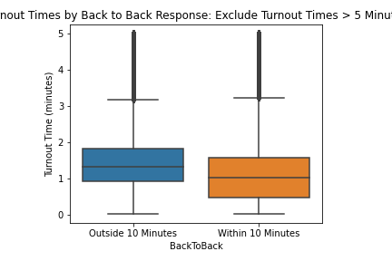
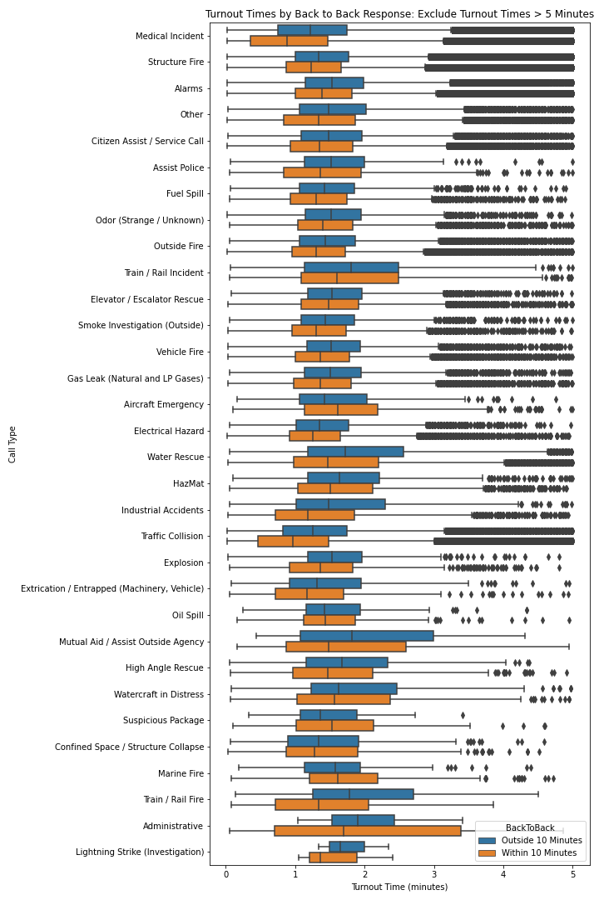
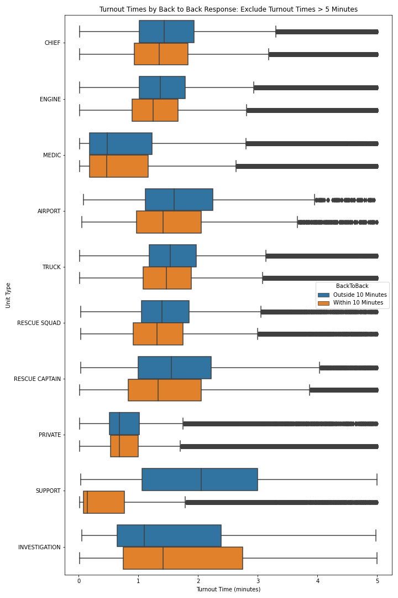

# Incidents Analysis

#### Assignment Summary

- Task 1: Completed
- Task 2: Brainstorming
- Total Time Spent on Assignment:
  - 2.5-3.0 hours on Task 1
    - Most of the time spent was on attempting to understand the data set, verifying the quality of the data, creating features for task 1, and waiting for the data to process.
  - 1.0 hours on write-up and brainstorming Task 2

### Task 1

#### Evening incidents have slower turnout times

**Summary**: Based on a few quick data visualizations, I don't see a significant difference in the turnout times between evening incidents and incidents at all other times.

The boxplot shown belows shows the difference between evening incidents and none-evening incidents. As seen below there is not significant difference in the turnout times.

 

The boxplot below shows the same relationship but at the yearly level. Even as time goes on there is no significant different between the turnout times based on time of day. 

The same can be said for turnout times by call type.

The same can be said about turnout times by unit type.

**Notes**: 

- There are a lot of outliers present in the data. If I had the opportunity to speak with a subject matter expert I would like to understand why these outliers exists and how they should be handled. 

**Next Steps (If I had more time)**:

- Question the fire department and/or stakeholders to attempt to understand where the perceived trend has been seen from their experience. I would then investigate those cases or cases with similar characteristics to determine if the trend is present there.
- The current analysis only consists of visualizations and some basic descriptive statistics. Given more time and to draw statistically significant conclusions, I would conduct hypothesis tests to compare different metrics between the two populations such as difference of means and comparing whether the two distributions are significantly different. Given the variation in the data, techniques such as bootstrapping may be used.

#### Units with back to back responses have slower turnout times

**Summary**: Based on a few quick data visualizations, I don't see a significant difference int he turnout times between units with back to back responses and all other units. 

The charts below are very similar to above except the color now shows units finishing up a call within 10 minutes and outside of 10 minutes. Again, there are no statistically significant differences at the levels examined below. 

**Notes**:

- For this particular analysis one of the main assumptions is that the Unit ID is unique in the data set.
- Given this assumption, there are a lot of negative times present in the dataset. More than half of the dataset has a negative time since last available and next dispatch. I explored whether each Unit ID was unique to each Batallion but there were still negative times. Given more time I would investigate further as this consumed a lot of my time. 
- Similar to the above, there are a lot of outliers in the turnaround time.

**Next Steps (If I had more time)**:

- I would get more information on the definition of a back to back response. As mentioned above, a majority of the calculate values are negative and this doesn't make sense to me. I would need to understand some of the business rules for how units are dispatched. For example, can units respond to dispatch calls before becoming available? 
- Similar to the above statistical tests would be used to determine whether the effect we are seeing is significant or could have occured by chance.

### Task 2

#### EDA/Insights I Would Dig Into If I Had More Time:

- Response time by order that each unit arrived in. For example, does the second or third dispatched unit take more time than the first unit.
  - What percentage of the time are the second and other units on scene after the first one?
- Does the response time vary by the the location of the incident? 
  - Does it vary by the location of the prior incident?
  - Are certain neighborhoods, locations, roads, etc. more prone to incidents?
  - Can this be used to predict the time to get to the incident?
  - Can this be used to choose the unit that is closest to the incident or closest to finishing up, instead of dispatching a free unit that is far away?
  - How far do units typically travel?
- What other factors cause the response time to vary? 
  - Time of day: Morning, evening, night
  - Holidays or special events; ex: Immediately after lunch, dinner, football games
- Are there are trends by the incident type? 
  - For example, are certain incidents growing at a faster rate than other incidents? Declining faster?
  - Do certain incidents require more or less units on the scene?
  - Are these exceptions to this? Should these be flagged as a possible over or under staffed incident?
- Can we predict the number and type of incidents? 
  - Are certain areas more prone to certain types of incidents? 
  - Can this model be used to schedule appropriately?
- Can we calculated idle time of each unit?

